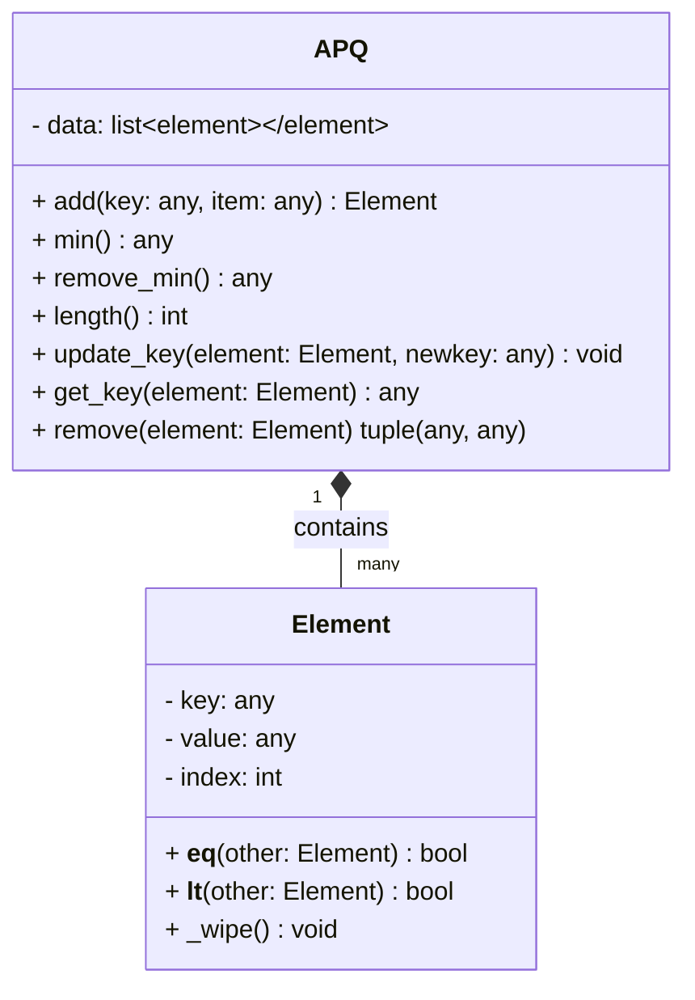

# Dijkstra Project

# Project Setup and Running Experiments

Each question from the assignment can be run with separate py files.

The py files are named according to the specific task they address

Note - please ensure your python3 version is 3.6 or greater - this because the print functions
use the f-strings feature - hopefully this should not be an issue as 3.6 was release in 2016.

Note - if you want to run the pytest - ensure it is installed on your system.

The following is recommended:

```bash

python3 run_question1.py
python3 run_question2.py
# Pipe it to your file name of choice 
python3 run_question3.py > q3_results.txt
python3 run_question4.py > q4_results.txt
python3 run_question5.py > q5_results.txt
python3 run_question6.py > q6_results.txt

```

## Part 1 - Implementation of Dijkstra

Part 1 of this assignment was to implement Dijkstra's algorithm to find the shortest path from a source vertex
to another vertex in a *weighted* graph. There are three aspects worth highlight - the Graph, the APQ and the algorithm

### The Graph Implementation
The graph implementation from Labs was reused, which is based upon an adjacency map implementation.

```python

    def __init__(self):
        """ Create an initial empty graph. """
        self._structure = dict()
        # adding a new dict to ultimately optimize get_vertex_by_label
        self._vertex_map = {}

```
The other noteworthy aspect to point out is an improvement made to the reused `Graph` implementation is the performance 
improvement made to address the inherited O(n) implementation, changing it to an O(1) improvement by using a `_vertex_map` 
dictionary for fast lookup.

```python


    def get_vertex_by_label(self, element):
        """ get the first vertex that matches element. 
        
        updated to use the hash map feature of a dictionary for fast lookup
        """
        return self._vertex_map.get(element, None)

```

### The APQ

The APQ implementation - which is required for the Dijkstra algorithm - is implemented using an unsorted list to begin with.
In later parts of the assignment a second implementation was required - an APQ using a binary heap. 

Below is the APQ ADT - from which we implement to.


### Dijkstra's Algorithm

The implementation of Dijkstra takes in a source as the 1st vertex and destination as the 2nd vertex.
and returns a **closed** dictionary where the vertex is the key and its value is a pair consisting of path 
length from source and preceding vertex

```python

def dijkstra_source_to_dest(start, end, graph, pq_class, break_if_end_found=False):
    """
    Computes the shortest path from a given source vertex to a specified destination vertex
    using Dijkstra's algorithm with an Adaptable Priority Queue.

    Args:
        
        start -- The starting vertex for the shortest path calculation.
        end -- The destination vertex where the shortest path terminates.
        graph -- The Graph instance containing vertices and weighted edges.
        apq_class -- supporting APQ and standard PQ - APQUnsortedList, APQBinaryHeap, 
                     PriorityQueue
        break_if_end_found -- boolean controlling if the algo breaks out when finding 
                              target immediately or not.

    Returns:
        A closed dictionary containing
        - Vertex as the key.
        - value is a pair consisting of path length from source and preceding vertex.

    """
```

From the above, the reader may also observe the additional arguments - `graph`, `pq_class` and `break_if_end_found`.
These were added as the project evolved. 

Many of the experiments described later involved creating multiple random graph
instances, moving `dijkstra_source_to_dest(...)` from outside the `graph.py` python file not only presents a cleaner more
legible code base but also allowed for the flow control in the performance runs to be more intuitive.

The `pq_class` argument allows us to take advantage of the fact that whether we end up using an unsorted list or binary
heap, the APQ API remains consistent. 
For the more basic Priority Queue introduced later, this is a modest subset of the APQs we use. Thus, this argument 
allows the caller to choose what type of priority queue they wish to use and within the
dijkstra implementation we can abstract its usage.

We discuss the `break_if_end_found` in Part 6 of this report where its usage is more pertinent.

### Testing Dijkstra Implementation

For details on how the algorithm works, please see the `dijkstra.py` python file, where the code is marked up
with verbose comments.

To run part 1 of the assignment, please ensure your python3 version is 3.6 or greater - this because the print functions
use the f-strings feature - hopefully this should not be an issue as 3.6 was release in 2016. 

To run part 1 of the assessment - who's purpose it is to validate dijkstra is implemented correctly, execute `python3 run_question1.py`

This evaluation script uses the `simplegraph2.txt` and generates a graph from the data therein. We reuse the given 
'def graphreader(filename)' to create a graph instance. There-after we invoke dijkstra with 2 specific vertices - `14` 
as source and `5` as destination. Using there we check if the resulting length is `16`  with a preceding vertex on its 
path being `8`

If the reader inspects the recorded output - `evaluation_q1.txt` - we can see our dijkstra results match the expected
result. Thus, we can be confident of the implementation of the algorithm.

## Part 2 - Generating Random Graphs

Part 2 of the assignment is to build upon Part 1 and build a grid-graph generator to generate random `Grid` object instances. The edges weighted, non-directional with a randomly generated weight in the range `1 to max(n,m)//2`.

Each node corresponds to an entry in an n x m grid, and there is an edge from each node [i][j] to [i+1][j] adn to [i][j+1]

The grid-graph generator is reletavily trivial - a nested j loop inside an i loop - run on two seperate occassions, the first run to create a vertex for every n x m, the second to wire the edges as per the description above assigning a random number each time an edge is created.

The code in `run_question2.py` is self-explanatory. 

### Running and Testing Part 2

To run the second task, simple run `python3 run_question2.py`. If you wish to persist the results, simply pipe (`>`) to a file name of your choosing.
The output is quite verbose - printing all vertex instances, all edges with weights. Then shortest paths from source to every destination is presented. The expectation for Part 2 is the grid size is small, so we can expose the mentioned data without too much burden on the reader.

Regarding testing, the recommendation to the reader, as the grid-graph is randomly generated each run, is to copy-paste the Vertices and Edges from the printout and query your GPT of choice - asking it for the shortest path from (0,0) to (3,3). Then compare its response with your results. You should see the algorithm is performing accurately.

## Part 3 - Evaluate Dijkstra for growing Graph sizes for 2 fixed nodes

Describe how to run the test.

Record the results - pipe to output file.

Comment on results - hint - there may be something to be said related to my APQ implementation

## Part 4 - Evaluate Dijstra for fixed Graph size but all notes shortest paths

Describe how to run the test.

A hybrid of Part3 - now I need to fix the size to 500, us the center node (250,250) as source and find all paths to all other nodes

## Part 5 - Evaluate Binary Heap APQ

Describe how to run the test.

Repeat Part 3 for Binary Heap and compare results with part 3

## Part 6 Evaluate Simple Priority Queue

Describe how to run the test.

Repeat part 4 with this PQ implementation and present results.

