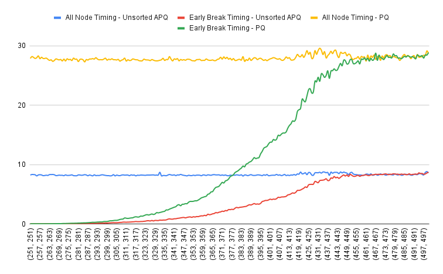

# Dijkstra Project

## System Requirements

- This project requires python 3.6 or greater to run. Note for printing it uses the `f-string` feature, which was introduced in the mentioned version.
- If you want to run the test harness, please ensure you have `pytest` installed.
- A pretty beef machine is required, especially for `run_question4.py` and `run_question6.py`

## Setting up the project.

The easiest way to run this project is to `git clone https://github.com/godziller/dijkstra_project.git`

If you choose to install manually, via zip download, please ensure the directory/file structure is as described below.

## Project Structure

```
The file and directory structure is as follows:
├── dijkstra_algos                  # My Dijksta Algorithm
│   └── dijkstra.py
├── graph                           # Graph Implemenation
│   ├── graph_dijkstra.py
│   ├── graph.py
│   └── __init__.py
├── pq                              # Various Priority queue implementations
│   ├── apq_binary_heap.py
│   ├── apq_unsorted_list.py
│   ├── __init__.py
│   ├── priority_queue_binary_heap.py
│   └── priority_queue_unsorted.py
├── report                          # Project report. Archived evaluation runs for convienence
│   ├── Binary_Heap_Vs_Unsorted_List.png
│   ├── evaluation_q1.txt
│   ├── evaluation_q2.txt
│   ├── evaluation_q3.txt
│   ├── evaluation_q4.txt
│   ├── evaluation_q5.txt
│   ├── evaluation_q6.txt
│   ├── question4.png
│   ├── question6.png
│   ├── REPORT.md                   # Project report
│   └── REPORT.pdf                  # PDF of project report
└── tests                           # Test Folder
    ├── __init__.py
    ├── test_apq_binary_heap.py
    ├── test_apq_unsorted_list.py
    ├── test_graph.py
    └── test_priority_queue.py
├── README.md                       # This readme
├── run_question1.py                # All the evaluation runs
├── run_question2.py
├── run_question3.py
├── run_question4.py
├── run_question5.py
└── run_question6.py
```

## Running the evaluations

To make it easier, I tried to follow the same pattern for running each evaluation from Part 1 -> 6. 

Simply execute `python3 run_question[VER].py` where VER is 1 to 6, matching assignment question 1 to 6.

Each outputs to terminal. But you can redirect to a file, name of your choosing using the standard linux `>` mechanism.

Inside `report/` you will find a set of file, `evaluation_q[VER].txt` where VER is as described immediately above.

These evaluation files provided the bases for the report, documented in REPORT.md and this pdf.
## Part 1 - Implementation of Dijkstra

Part 1 of this assignment was to implement Dijkstra's algorithm to find the shortest path from a source vertex
to another vertex in a *weighted* graph. There are three aspects worth highlight - the Graph, the APQ and the algorithm

### The Graph Implementation
The graph implementation from Labs was reused, which is based upon an adjacency map implementation.

```python
    def __init__(self):
        """ Create an initial empty graph. """
        self._structure = dict()
        # adding a new dict to ultimately optimize get_vertex_by_label
        self._vertex_map = {}
```
The other noteworthy aspect to point out is an improvement made to the reused `Graph` implementation is the performance 
improvement made to address the inherited O(n) implementation, changing it to an O(1) improvement by using a `_vertex_map` 
dictionary for fast lookup.

```python
    def get_vertex_by_label(self, element):
        """ get the first vertex that matches element. 
        
        updated to use the hash map feature of a dictionary for fast lookup
        """
        return self._vertex_map.get(element, None)
```

### The APQ

The APQ implementation - which is required for the Dijkstra algorithm - is implemented using an unsorted list to begin with.
In later parts of the assignment a second implementation was required - an APQ using a binary heap. 

Below is the APQ ADT - from which we implement to.


### Dijkstra's Algorithm

The implementation of Dijkstra takes in a source as the 1st vertex and destination as the 2nd vertex.
and returns a **closed** dictionary where the vertex is the key and its value is a pair consisting of path 
length from source and preceding vertex

```python
def dijkstra_source_to_dest(start, end, graph, pq_class, break_if_end_found=False):
    """
    Computes the shortest path from a given source vertex to a specified destination vertex
    using Dijkstra's algorithm with an Adaptable Priority Queue.

    Args:
        
        start -- The starting vertex for the shortest path calculation.
        end -- The destination vertex where the shortest path terminates.
        graph -- The Graph instance containing vertices and weighted edges.
        apq_class -- supporting APQ and standard PQ - APQUnsortedList, APQBinaryHeap, 
                     PriorityQueue
        break_if_end_found -- boolean controlling if the algo breaks out when finding 
                              target immediately or not.

    Returns:
        A closed dictionary containing
        - Vertex as the key.
        - value is a pair consisting of path length from source and preceding vertex.

    """
```

From the above, the reader may also observe the additional arguments - `graph`, `pq_class` and `break_if_end_found`.
These were added as the project evolved. 

Many of the experiments described later involved creating multiple random graph
instances, moving `dijkstra_source_to_dest(...)` from outside the `graph.py` python file not only presents a cleaner more
legible code base but also allowed for the flow control in the performance runs to be more intuitive.

The `pq_class` argument allows us to take advantage of the fact that whether we end up using an unsorted list or binary
heap, the APQ API remains consistent. 
For the more basic Priority Queue introduced later, this is a modest subset of the APQs we use. Thus, this argument 
allows the caller to choose what type of priority queue they wish to use and within the
dijkstra implementation we can abstract its usage.

We discuss the `break_if_end_found` in Part 4 of this report where its usage is more pertinent.

### Running and Evaluating Dijkstra Implementation

For details on how the algorithm works, please see the `dijkstra.py` python file, where the code is marked up
with verbose comments.

To run part 1 of the assignment, please ensure your python3 version is 3.6 or greater - this because the print functions
use the f-strings feature - hopefully this should not be an issue as 3.6 was release in 2016. 

To run part 1 of the assessment - who's purpose it is to validate dijkstra is implemented correctly, execute `python3 run_question1.py`

This evaluation script uses the `simplegraph2.txt` and generates a graph from the data therein. We reuse the given 
'def graphreader(filename)' to create a graph instance. There-after we invoke dijkstra with 2 specific vertices - `14` 
as source and `5` as destination. Using there we check if the resulting length is `16`  with a preceding vertex on its 
path being `8`

If the reader inspects the recorded output - `evaluation_q1.txt` - we can see our dijkstra results match the expected
result. Thus, we can be confident of the implementation of the algorithm.

## Part 2 - Generating Random Graphs

Part 2 of the assignment is to build upon Part 1 and build a grid-graph generator to generate random `Grid` object instances. The edges weighted, non-directional with a randomly generated weight in the range `1 to max(n,m)//2`.

Each node corresponds to an entry in an n x m grid, and there is an edge from each node [i][j] to [i+1][j] adn to [i][j+1]

The grid-graph generator is relatively trivial - a nested j loop inside an i loop - run on two separate occasions, the first run to create a vertex for every n x m, the second to wire the edges as per the description above assigning a random number each time an edge is created.

The code in `run_question2.py` is self-explanatory. 

### Running and Evaluating

To run the second task, simple run `python3 run_question2.py`. If you wish to persist the results, simply pipe (`>`) to a file name of your choosing.
The output is quite verbose - printing all vertex instances, all edges with weights. Then shortest paths from source to every destination is presented. The expectation for Part 2 is the grid size is small, so we can expose the mentioned data without too much burden on the reader.

Regarding testing, the recommendation to the reader, as the grid-graph is randomly generated each run, is to copy-paste the Vertices and Edges from the printout and query your GPT of choice - asking it for the shortest path from (0,0) to (3,3). Then compare its response with your results. You should see the algorithm is performing accurately.

## Part 3 - Evaluate Dijkstra for growing Graph sizes for 2 fixed nodes

Part 3 of the assignment is to evaluate the impact of growing grid sizes on dijkstra's performance.
We continue to use the unsorted list APQ.

```python
if __name__ == "__main__":
    benchmark_dijkstra(APQUnsortedList)
```

As directed, as we increase the size of the graph for each run, we measure the performance from an anchor vertex (0,0) to a ever moving destination vertex (n//2, m//2) - where n and m represent the size of the grid graph each time we increase the graph size. We use a increment size of 20 each iteration.

```python
    for size in range(20, 501, 20):
        total_time = 0
        for _ in range(10):
            graph = generate_weighted_grid_graph(size, size)
            start_vertex = graph.get_vertex_by_label((0, 0))
            end_vertex = graph.get_vertex_by_label((size // 2, size // 2))

            start_time = time.perf_counter()
            results = dijkstra_source_to_dest(start_vertex, end_vertex, graph, priority_queue_type)
            total_time += time.perf_counter() - start_time

        avg_time = total_time / 10
```

For every singular graph-size run, we create 10 instances of that size to get an average of the algorithm's run.

While we are only interested in the performance of dijkstra, we print out the path length as well - in increments of 20, the output should not be too large to be cumbersome to read.

### Running and Evaluating

This experiment can be run by invoking:

```bash
python3 run_question3.py
```
Summarizing the output from running the above for an Unsorted List APQ, we get the following table.
We see exponential growth as the grid size increases.

| Grid Size | Time Taken (sec) |   | Grid Size | Time Taken (sec) |
|-----------|-----------------|---|-----------|-----------------|
| 20x20     | 0.000798        |   | 260x260   | 0.623704        |
| 40x40     | 0.003260        |   | 280x280   | 0.789453        |
| 60x60     | 0.009301        |   | 300x300   | 0.963284        |
| 80x80     | 0.020247        |   | 320x320   | 1.138039        |
| 100x100   | 0.036878        |   | 340x340   | 1.380741        |
| 120x120   | 0.063456        |   | 360x360   | 1.635780        |
| 140x140   | 0.105408        |   | 380x380   | 1.966757        |
| 160x160   | 0.160776        |   | 400x400   | 2.255509        |
| 180x180   | 0.208844        |   | 420x420   | 2.578821        |
| 200x200   | 0.283467        |   | 440x440   | 2.942701        |
| 220x220   | 0.381146        |   | 460x460   | 3.375868        |
| 240x240   | 0.490340        |   | 480x480   | 3.880582        |
|           |                 |   | 500x500   | 4.338560        |


The following table is an analysis of this project's dijksta implementation:

| Operation                      | Worst-Case Complexity |
|--------------------------------|-----------------------|
| **Loop runs n times**          | O(n)                  |
| **remove_min() in each iteration** | O(n)                |
| **Processing neighbors (2 per vertex)** | O(1) each         |
| **update_key() (O(n)) or add() (O(1))** | O(n) per update   |


- **Loop runs n times**: The loop iterates once for each vertex (n vertices), so the loop complexity is O(n).
- **remove_min()**: In each iteration, you remove the minimum element from the priority queue, which involves scanning through the queue. If the queue holds n elements, the complexity of this operation is O(n).
- **Processing neighbors (2 per vertex)**: Processing the neighbors (in grid-graph case, 2 neighbors per vertex) remains O(1) per neighbor because this step is independent of the number of vertices.
- **update_key() or add()**: When updating a vertex's priority/distance in the priority queue, you might need to perform a linear search (O(n)) in the worst case. If you are simply adding a new vertex, this is an O(1) operation, but the worst-case update still involves O(n) complexity.
- 

In code, the above can be reflected in these two following code snippets:

`remove_min()` and the offending O(n) line is identified below.
```python
   def remove_min(self):
        """
        remove_min()
        Remove and return the value with the minimum key.
        O(n)
        """
        if not self._data:
            return None
        min_index = 0
        for i in range(1, len(self._data)):     # The O(n) culprit
            if self._data[i]._key < self._data[min_index]._key:
                min_index = i
        # Swap the minimum element with the last element
        self._data[min_index], self._data[-1] = self._data[-1], self._data[min_index]
        self._data[min_index]._index = min_index  # update the swapped element's index
        removed = self._data.pop()  # O(1) removal from the end
        value = removed._value  # store value before wiping, if I don't I loose the value
        removed._wipe()  # O(1)
        return value
```

Thus, for the above we can say Dijksta is performing with O($n^2$). This analysis is reflected in the data collected above.

The above is run within the following `while` loop - this being our second O(n)
```python
    while pq.length() > 0:
        current = pq.remove_min()
```

## Part 4 - Evaluate Dijkstra for fixed Graph size but all notes shortest paths

Part 4 builds on Part 3, asking the open question - would Dijkstra's performance improve if it checked whether a node being removed from the heap is the destination and if so break out of the loop returning the current tree.

The raw data can be viewed in `evaluation_q4.txt`. Below is a graphical representation of the performance run.

### Running and Evaluating

Building follows the same pattern as before, invoking - `python3 run_question4.py`

To the reader, the first observation is the all-nodes timing. This is quite consistent at circa 8.5sec. This can be explained as the graph size is static at 500x500, thus the algorithm touches all vertexes for this pass - so the horizontal reading is to be expected.

The "Early Break Timing" data is more intriguing. First a detailed explanation how the code behaves here.

Earlier we made reference to `break_if_end_found` parameter, this is where it is used.

`break_if_end_found` is a boolean that the caller sets True/False if they wish dijksta to break early if the destination is found.

```python
def dijkstra_source_to_dest(start, end, graph, pq_class, break_if_end_found=False):
    """
    Computes the shortest path from a given source vertex to a specified destination vertex
    using Dijkstra's algorithm with an Adaptable Priority Queue.

    Args:

        start -- The starting vertex for the shortest path calculation.
        end -- The destination vertex where the shortest path terminates.
        graph -- The Graph instance containing vertices and weighted edges.
        apq_class -- supporting APQ and standard PQ - APQUnsortedList, APQBinaryHeap, PriorityQueue
        break_if_end_found -- boolean controlling if the algo breaks out when finding target immediately or not.

```

Its use in the code is quite trivial, as the variable `current` iterates though the vertexes while performing dijkstra, this simple check below determines if current is now in-fact the target vertex being sought.
```python
        # You have arrived, disembark the dijkstra train
        # This break_if_end_found allows us to exit quicker..
        if break_if_end_found and current == end:
            break
```

From the graph below, one can see the performance of dijkstra increases exponentially as the target vertex increases in distance from the source vertex. When the vertex is close, there is a higher probablity of finding it early, thus breaking and returning early. As the distance to the target vertex increases, the probably of finding the target earlier decreases, thus more vertex nodes need to be interrogated for distance.

One can see at vertex (431,431) the performance is approaching the non-breaking behaviour and plateaus from there onwards.

Ignoring edge weighting and calculating the number of edges from 250,250 to 431,431 we get:

\[
No of Edges = |x - x\`| + |y - y\`|
\]

\[
d = |431 - 250| + |431 - 250|
\]

\[
d = 181 + 181 = 362
\]

So, we can say when the target of a grid graph increases beyond 362 edges from the source, the benefits of breaking early if the target is found is reduced significantly.


## Part 5 - Evaluate Binary Heap APQ

Part 5 is concerned with evaluating two types of APQ implementations - Binary Heap vs Unsorted List.

This evaluation is a repeat of Part 3, but using Binary heap.

To run this evaluation, execute `python3 run_evaluation5.py`. Again if you want to persist the results, pipe (`>`) to a filename of your choosing.

Part 5 presents an opportunity to discuss our code some more. Earlier, we made reference to the pq_class in our dijkstra operation signature - `def dijkstra_source_to_dest(start, end, graph, pq_class, break_if_end_found=False)`. The modest consideration made in abstracting the APQ type here now pays dividends. 

Moving from running the dijkstra implementation from unsorted list to binary heap is as trivial as changing from:
```python
dijkstra_source_to_dest(start_vertex, end_vertex, graph, APQUnsortedList)
```
to
```python
dijkstra_source_to_dest(start_vertex, end_vertex, graph, APQBinaryHeap)
```

While the implementation does need to understand it is working with an APQ, it is completly oblivious to which one, as the code references the APQ as 'pq'

```python
    # This comes in handy as our 2 APQ implemenations use the same apis, so we can save a bit of code here.
    # the caller of this function will specify which to use.
    pq = pq_class()
```

Some adjustment is required for a vanilla Priority Queue - but we will address this in Part 6.

### Running and Evaluating

To run this evaluation, execute `python3 run_evaluation5.py`. Again if you want to persist the results, pipe (`>`) to a filename of your choosing.

Below is a graph comparing the performance of dijkstra run with both an unsorted list and binary heap implementation of APQ.

As can be seen, for smaller grid sizes circa 22500 (150x150) both perform relatively similar. However what is clear is as the grid size grows the binary heap implementation consistently and increasingly outperforms its unsorted list sibling.


The following table compares the two implemenation for the dijksta implemenation:

The following table compares the two implementations for the Dijkstra implementation:

| Implementation        | Loop Runs (n) | `remove_min()` per Iteration | Processing Neighbors       | `update_key()` or `add()` | Total Complexity |
|----------------------|---------------|-----------------------------|----------------------------|---------------------------|------------------|
| **Unsorted List APQ** | O(n)          | O(n)                        | O(1) per neighbor (2 per vertex) | O(n) per update           | **O($n^2$)**     |
| **Binary Heap APQ**   | O(n)          | O(log n)                    | O(1) per neighbor (2 per vertex) | O(log n) per update       | **O(n log n)**   |

- **Unsorted List APQ** results in **O($n^2$) complexity**, making it inefficient for large graphs.
- **Binary Heap APQ** achieves **O(n log n) complexity**, which is significantly faster and optimal for Dijkstra’s algorithm.


- **Unsorted List APQ** results in **O($n^2$) complexity**, making it inefficient for large graphs.
- **Binary Heap APQ** achieves **O(n log n) complexity**, which is significantly faster and optimal for Dijkstra’s algorithm.

## Part 6 Evaluate Simple Priority Queue

The final Part 6 is to compare the standard PQ with the earlier APQ - we choose both unsorted for this run.

Before we comment on the performance, it is best to explain how we accommodate this third queue variation in code.

We use the familiar operation call `early_break_vanilla_pq = benchmark_all_nodes_dijkstra(target, PriorityQueue, graph_set, if_found_break=True)`, this time passing our Priority Queue Class. While this PQ is very similar to the APQs that have been used earlier, it does have some modest differences - namely it does not support the ability to update an element's priority - `update_key()`.

Thus, inside the dijkstra implementation, we have two jobs - the first is to recognize if an inbound queue is adaptable or not (i.e. an APQ or PQ). There after treat it accordingly.

Recognizing if the requestor is directing us to use a PQ or not is trivial, and accomplished via this code snippet:

```python
    # We begin by creating a flag to control the flow - PQ vs APQ
    is_pq_adaptable = pq.__class__.__name__ != "PriorityQueue"
```
with this flag, the following is where the difference between these two variants is handled:

```python
                # This block is where the difference between queue types is seen in action
                # APQ take advantage of update_key
                # PQ has no such feature
                if is_pq_adaptable:
                    # This is where the APQ update_key kicks in - distance represents priority
                    # so if it is already in the apq, then update, otherwise just add.
                    if neighbour in pq_elements:
                        pq.update_key(pq_elements[neighbour], new_distance)
                    else:
                        pq_elements[neighbour] = pq.add(new_distance, neighbour)
                else:
                   # For standard PQ we don't need a location dictionary - pq_elements[]
                    pq.add(new_distance, neighbour)
```

Two aspects of the above are notable.
- the flag is used to put `update_key()` into play or not - for standard PQ it isn't available.
- both types have an `add()`, however the location dictionary - `pq_elements[]` is redundant, so we keep it unused and empty - to avoid consuming memory.

### Running and Evaluating

To run Part 6 evaluation, simply invoke `python3 run_question6.py`

The graph below presents the performance evaluation of 4 seperate dijkstra runs, each using the same graph instance for each iteration. The four runs are:

- Our APQ unsorted list with `break_if_end_found` disabled
- Our APQ unsorted list with `break_if_end_found` enabled
- Our PQ unsorted list with `break_if_end_found` disabled
- Our PQ unsorted list with `break_if_end_found` enabled



The first observation from the graph above it the patterns between the runs share a similar pattern. However, what we can also see is there is a significant difference in performance - the APQ far outperforms its PQ sibling.

As the only difference between these are the ability to update the weight/priority of a Vertex, this is where we should focus our attention on. Why would the lack of an `update_key()` mechanism have such a dramatic impact?

The reason is, the PQ will add duplicate keys for a vertex if a more favourable weight is discovered through dijksta. While the queue is priority ordered, which allows dijksta still to perform with **accuracy**, it does however mean the PQ will suffer more because the queue length will grow as duplicates are added. Thus for the `remove_min()`, which is O(n) for the APQ, will grow in cost as duplicates are added. Thus, be less performant. This is why, while the pattern is similar, there is a stepwise degradation in performance for the PQ in comparison to the APQ.


## Citations, Tools and Reuse

This section to clearly describe what was reused vs. created from scratch

- I reused the Graph implementation (`graph.py`) from earlier Semester 2 graph labs 4.
- The reused the PQBinaryHeap implementation from Semester 1 Lab 7. This provided the basis for my APQBinaryHeap implementation (`apq_binary_heap.py`).
- L12-AdaptablePriorityQueue provided the inspiration for both my `PriorityQueue` and `APQUnsortedList` implementation.
- While I implemented dijkstra, inspiration was taken from Semester 2 Lab 5 `graph-traversal.py`, especially in understand how to construct the return structure.
- Google was used to help me with creating the directory structure. My start was very messy and I was loosing my way, so I searched for best practices in directory structure.
- The test harness in tests/ was generated from ChatGPT - this inspired by my research on directory layout. As tests are not part of the assignment, I chose this path. Initially I thought it was overkill, but I was thankful when I changed my graph implementation mid way and this helped me catch a bug early.
- I used PyCharm as my development environment, and used the breakpoint/debug feature to help me especially with the dijkstra algorithm.
- I used PyCharm's pdf generator to generate my pdf from this markdown file.
- I used a mermaid plugin (https://mermaid.js.org/) to create my class diagram 
- Used google to assist with markdown advanced feature, like tables, embedding images and mathematical notation like squaring - $V^2$